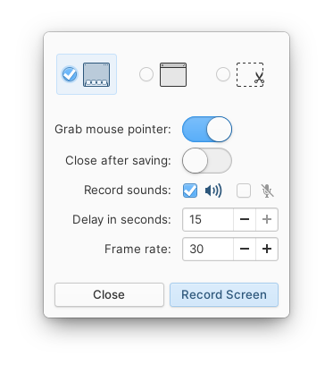
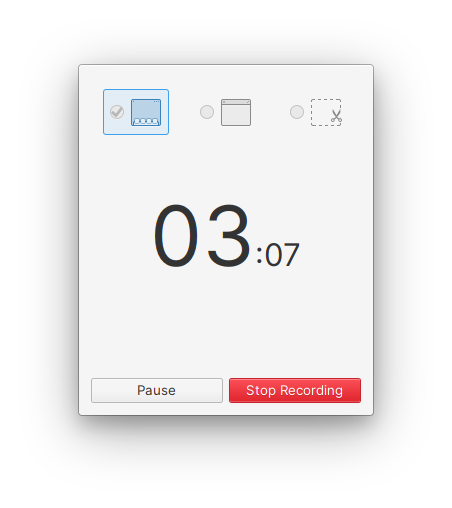
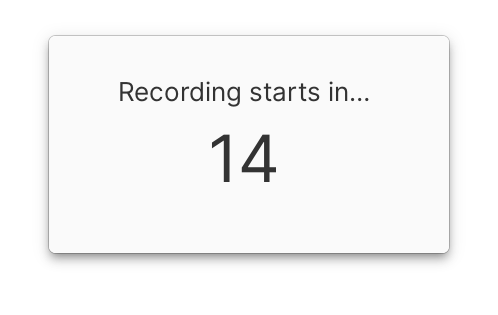
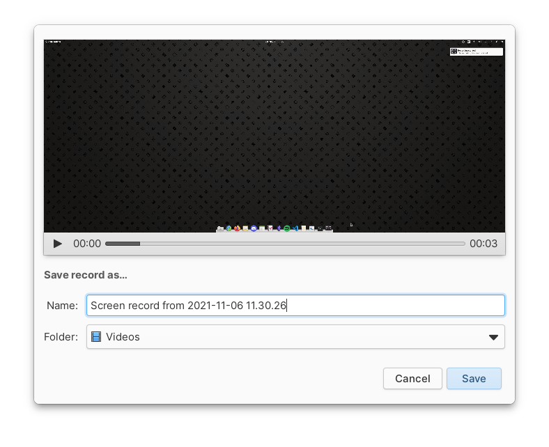

# ScreenRec

-----------------------

Due to many limitations coming from the Flatpak AppCenter of elementary OS. The project will not be able to evolve anymore. That's why this project is now archived. 😞

-----------------------

A simple screen recording tool which was make to work like the elementary OS Screenshot tool.

  

## Building & Installation

You'll need the following dependencies:

* meson
* libgranite-dev
* libgtk3-dev
* libx11-dev
* libgstreamer1.0-dev
* libclutter-gst-3.0-dev
* libclutter-gtk-1.0-dev
* libpulse-dev
* valac

Run `meson` to configure the build environment and then `ninja` to build and install

    meson build --prefix=/usr
    cd build
    ninja

To install, use `ninja install`, then execute with `com.github.dr_styki.screenrec`

    sudo ninja install
    com.github.dr_styki.screenrec

## Credits
Originaly forked from [screenrecorder](https://github.com/Mohelm97/screenrecorder). Now greatly inspired by the code of [Screenshot](https://github.com/elementary/screenshot), [Kazam](https://github.com/hzbd/kazam) and [Screencast](https://github.com/artemanufrij/screencast).
Icon by [Nararyans R.I. (Fatih20)](https://github.com/Fatih20). Video of Fatih20 making the icon [here](https://lbry.tv/@Fatih109:4/Final-Design:6?r=Cg1pp5MCWV1a5Nj5jDumPs9b13dNZqWG)
