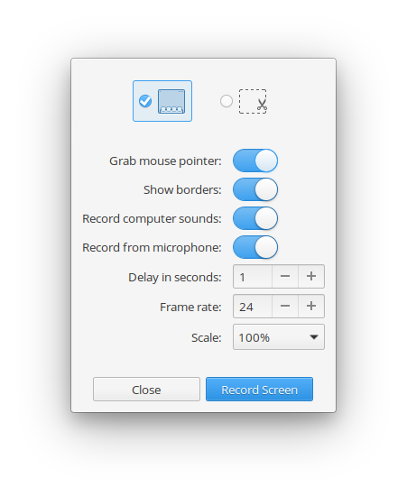
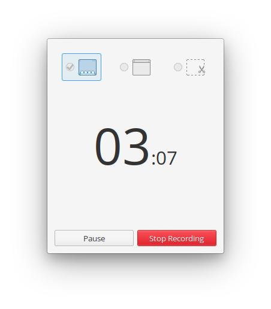

# ScreenRec
A simple screen recording tool which was make to work like the elementary OS Screenshot tool.

<!-- 

  

 -->

 

## Building & Installation

You'll need the following dependencies:

* meson
* libgranite-dev
* libgtk3-dev
* libx11-dev
* libgstreamer1.0-dev
* libclutter-gst-3.0-dev
* libclutter-gtk-1.0-dev
* valac

Run `meson` to configure the build environment and then `ninja` to build and install

    meson build --prefix=/usr
    cd build
    ninja

To install, use `ninja install`, then execute with `com.github.dr-styki.screenrec`

    sudo ninja install
    com.github.dr-styki.screenrec

## Credits
Originaly forked from [screenrecorder](https://github.com/Mohelm97/screenrecorder). Now GREATLY inspired by the code of [Screenshot](https://github.com/elementary/screenshot), [Kazam](https://github.com/hzbd/kazam), [Screencast](https://github.com/artemanufrij/screencast) and [screenrecorder](https://github.com/Mohelm97/screenrecorder).
